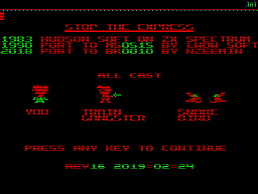

# bk0010-stopexpress
Porting game Stop the Express to BK-0010, work in progress.

The game for ZX Spectrum was written by Hudson Soft and published back in 1983.
In 1990 the game was ported to Elektronika MS-0515 (PDP11-like computer based on T11 clone) by unknown programmer in Lwow (Ukraine).
In 2017 I ported the game to UKNC.
And finally in September 2018 I started porting the game to BK-0010 machine.

The real challange was to fit 32K game into 16K RAM available on BK-0010.
So I stripped down the game: removed demo mode sequence, reduced number of tiles and re-worked the way the tiles drawn, removed locomotion tiles used on the last scene of the game,
the info screen now shown only once at the beginning and the memory used after that, and finally removed all sound effects.

Screenshots of the ported version:

Screenshot of the original game on MS-0515:

#### See Also

 - [Porting Stop the Express to UKNC](https://github.com/nzeemin/uknc-stopexpress)
 - [Porting BK game Lode Runner to UKNC](https://github.com/nzeemin/uknc-loderunner)
